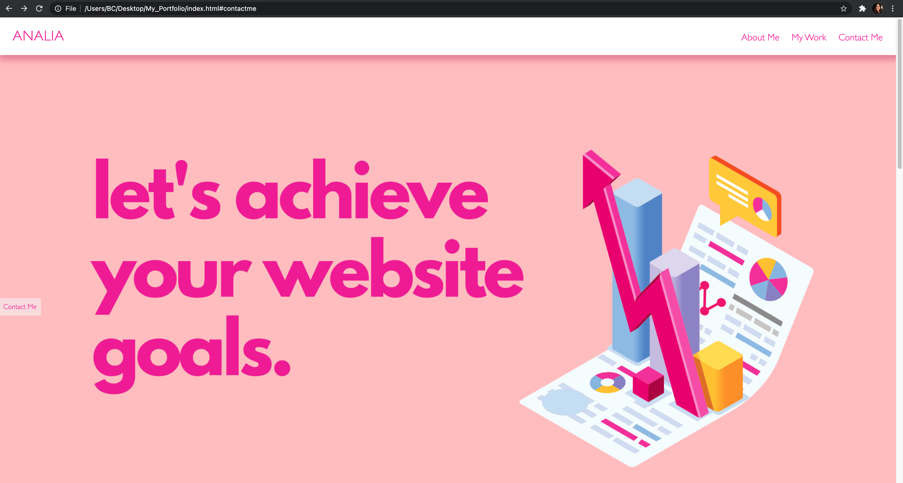

# 02 Advanced CSS: Portfolio

# Contents in HTML file:
- Started with Doctype html
- Set language to english us
- Included a head tag with meta charset, meta name and content
- Included links to reset.css and style.css in head tags
- Included title "Analia Mohamdally Portfolio" in head tags
- Included body tags
- Within body tags, there is a header, hero div, three sections and a footer
- Within the header, there is an h1 tag and a nav tag with an unordered list and a tags that link to the different sections within my porfolio. 
- Within the hero div, there is an img tag that holds an image that acts as my hero image. There is also a div("buttoncon") that holds a fixed button ("contactme")
- The first section is my 'about me' section that holds an h2 tag, an image and p tags that hold content about myself. There is also a button that links to a google docs with my resume.
- The second section is my 'my work' section that holds three separate divs that hold h4 tags and a tags that link to a google docs with my work. There is also a p tag that includes a sentence about my work.
- The third section is my 'contact me' section that holds an h2 tag and a div that holds my contact info. there are also a tags that link to my github and linkedin.
- There is a footer at the bottom that indicates that the page was made in 2021 by me 
- All images include alt attributes
- Each section was given ids so they can act as links in the unordered list. 
- The header, hero div, all sections and the footer were also assigned classes for css styling.

# Contents in CSS files:
- A reset.css file was included to remove browser default settings
- Within reset.css, there is a universal selector as well as body, html, h1-h6, ul, a and img resets

- A style.css was also included
- Within style.css, there is styling for the body, header, div hero section, 'about me' section, 'my work' section, 'contact me' section and footer.
- For the header, the header container was styled and flex was applied to enable responsiveness. The h1 tag was also styled. the unordered list was styled and flex was applied. The list links were also styled. A hover effect that changes the background colour of the a tags to yellow was also applied.
- The hero div was styled and flex was applied to enable responsiveness. The button was also styled and position was set to six. A hover effect that changes the background colour to yellow was also applied.
- The 'about me' section was styled and flex was also applied to enable responsiveness. The h2 tags, image and p tags were also styled. The 'resume' button was also styled and a hover effect that makes the bottom border yellow was also applied.
- The 'my work' section was also styled and flex was applied to enable responsiveness. Th e h3 tags, h4 tags and p tags were also styled. The image container 'imgcont' was also styled and flexbox was applied to enable responsiveness. The image was also styled. A hover effect that adds a purple glow to the images were also applied.
- The 'contact me' section was also styled and flex was applied to enable responsiveness. The h2 tags, p tags and a tags were also styled. The contact container 'contactcon' that holds my contact information was styled and flex was applied to enable responsiveness. A hover effect that adds a white bottom border was also applied to 'Github' and 'Linkedin'.
- The footer was also styled.
- To enable responsiveness for smaller screeens, media queries at a max-with:370px were included to adjust the display and style of the fixed button, the header container, the header unordered list and links, the first and second 'contact me' container as well as the'contact me' h2 tags. At max-with:370px, the header and contact me containers' are flexed in a column direction.

# Screenshot:
 

# Portfolio URL:
https://anamolly.github.io/My_Portfolio/