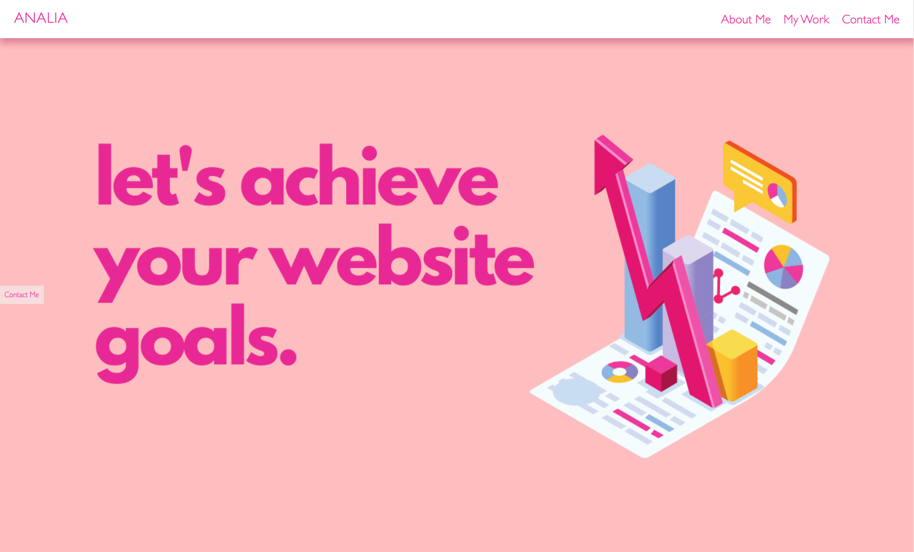

# My_Portfolio

  

  ## Description
  This is my developer porfolio. It contains a brief biography, some examples of my past projects as well as my contact information. If you have any questions, please feel free to contact me!
  

  Technologies used:
  - HTML
  - CSS 
  - Canva

  ## Portfolio URL:
  https://anamolly.github.io/My_Portfolio/

  # Table of Contents
  - [Installation Instructions](#installation-instructions)
  - [Usage Instructions](#usage)
  - [Test Instructions](#tests)
  - [Contributing](#contributing)
  - [License](#license)
  - [Questions](#questions)

  # Installation Instructions
  N/A

  # Usage
  If you would like to view my portfolio, please click on the above link that will redirect you to the deployed version.

   
   
   
   

  # Tests
  There are no tests for this project

  # Contributing
  There were no other collaborators involved in the development of My Portfolio.

  # License
  Click on the badge to learn more about this license:

  
  
  # Questions
  If you have any questions about this application, please reach out to me at: 

  - Email: analia.mohamdally@gmail.com
  - GitHub: AnaMolly, https://github.com/AnaMolly
